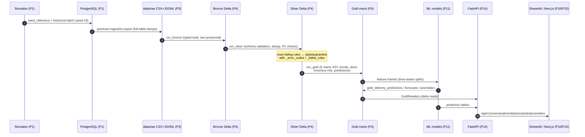
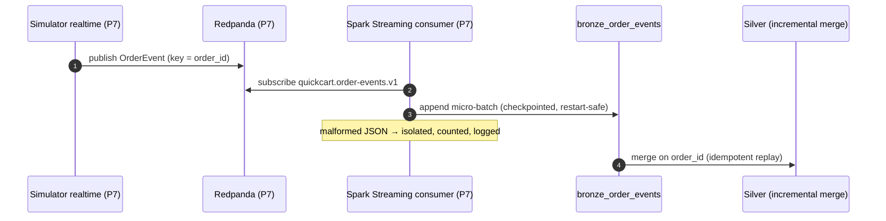
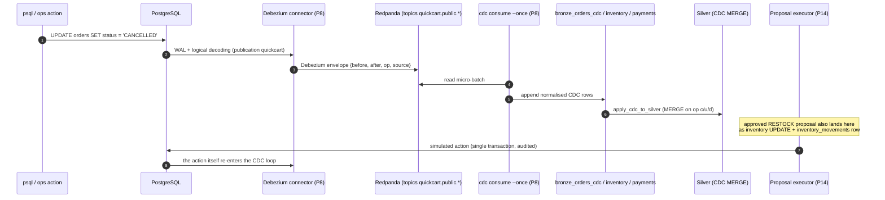
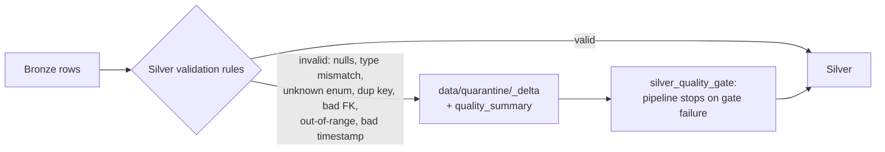

# Data Lineage — Order Data

How one order flows from generation to the UI, and where it can be quarantined.
Two paths exist — **batch** (full history) and **streaming/CDC** (live changes) —
and they converge in Bronze before the shared Silver → Gold lineage.

## Batch lineage (historical load)

## Streaming lineage (live order events)

## CDC lineage (operational change capture)

## Quarantine lineage (explainable failure path)

## Key lineage invariants

- **order_id is the merge key** end-to-end: batch loads, streaming merges, and CDC
  `op`-aware MERGEs all resolve to the same Silver entity.
- **Bronze is never destructive** — raw payloads stay replayable, so any downstream
  layer can be rebuilt.
- **Every rejected row is explainable**: quarantined records carry
  `_error_codes`, `_error_messages`, `_failed_rules`, `_quarantined_at`.
- **Silver quality gate blocks Gold**: if quarantine stats exceed thresholds, the
  pipeline fails visibly instead of publishing dirty marts (no silent fallback).
- **The serving lineage is read-only** except for the single audited path:
  human-approved proposals executing a simulated inventory write (Phase 14), which
  itself re-enters the CDC loop, closing the circle.
