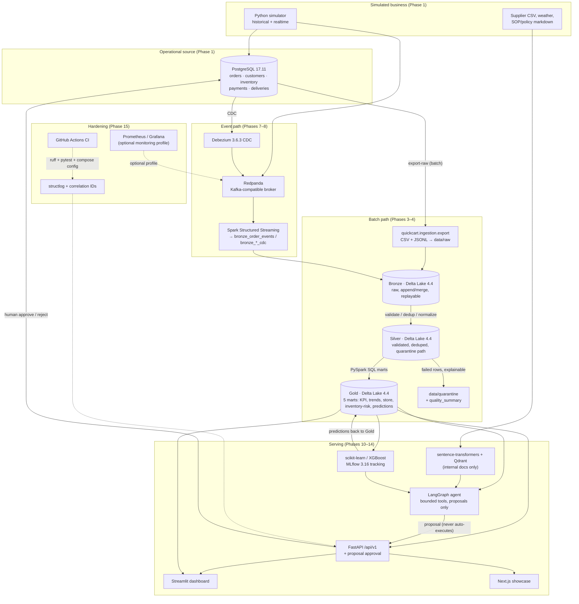

# System Map — QuickCart Intelligence Platform

The platform as actually implemented (mirrors `kit/01_ARCHITECTURE_AND_TECH_STACK.md` §2,
annotated with the phase that introduced each component). Render the mermaid blocks in
any GitHub/markdown viewer that supports mermaid.

## Component → phase map

| Component | Technology | Role | Phase |
|---|---|---|---|
| Business simulator | Python + Faker/NumPy | Generates orders, customers, inventory, payments, deliveries, events | 1 |
| Operational DB | PostgreSQL 17.11 | System of record (OLTP) | 1 |
| SQL learning branch | 30 exercises in `sql/exercises/` | Analytical SQL on the operational schema | 2 |
| Raw export | CSV + JSONL to `data/raw/` | Batch extraction from PostgreSQL | 3 |
| Lakehouse compute | PySpark 4.2.0 (Java 17) | Batch + streaming transformations | 3–5 |
| Lakehouse storage | Delta Lake 4.4.0 | Bronze / Silver / Gold ACID tables | 4 |
| Object storage | SeaweedFS (S3 API) | Lakehouse backend (local-first S3) | 6 |
| Streaming broker | Redpanda | Kafka-compatible event streaming | 7 |
| CDC | Debezium 3.6.3.Final | PostgreSQL change capture → Redpanda | 8 |
| Orchestration | Airflow 3.3.2 | Batch workflow scheduling | 9 |
| Dashboard | Streamlit | Operations UI on Gold marts | 10 |
| ML | scikit-learn / XGBoost (+ Spark MLlib) | Delivery delay, demand forecast, anomaly detection | 11 |
| Experiment tracking | MLflow 3.16.0 | Runs, metrics, artifacts | 11 |
| Embeddings | sentence-transformers | Local vector embeddings | 12 |
| Vector DB | Qdrant | RAG retrieval over internal documents | 12 |
| LLM serving | Ollama (qwen3) | Zero-cost local LLM inference | 12–13 |
| Agent | LangGraph + bounded tools | SQL / RAG / ML tool routing, proposals | 13 |
| API | FastAPI + uvicorn | Unified service boundary, human-approved actions | 14 |
| Frontend | Next.js showcase | Portfolio-grade operations console | 14–15 |
| CI | GitHub Actions | Ruff + Pytest + compose validation on every push | 15 |
| Observability | structlog correlation IDs; optional Prometheus/Grafana | Tracing + metrics | 15 |

## Platform flow

## Reading the map

- **One source of business truth**: PostgreSQL is the only OLTP store. Silver/Gold
  are derived analytical tables; the agent never maintains a hidden structured copy
  (kit/01 §3.3).
- **Two ingestion paths converge in Bronze**: batch export (raw files) and the
  event path (simulator events + Debezium CDC via Redpanda). Both are replayable
  and merge on keys.
- **Quarantine is a first-class output**: invalid rows are never silently dropped;
  they land in `data/quarantine` with structured error fields (kit/05 §10).
- **Human approval is the only mutation path**: the agent proposes; the API executes
  a validated, simulated action against PostgreSQL only after explicit approval,
  with an audit trail (Phase 14).
- **Phase 15 hardening** adds the CI gate, correlation-id tracing, and the optional
  monitoring profile — nothing in the critical path changes.
